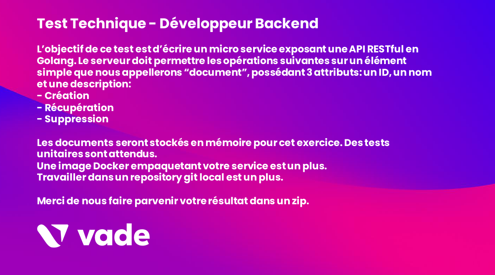

# document-api

This Project solve this:

 

## Prerequested

* Ubuntu 20.04
* Docker 
* Golan >= 1.18.3 (optional: local build only)

## Build

#### Local build

`go build`

#### Docker 

If your user is note inside a docker group as explain [here](https://docs.docker.com/engine/install/linux-postinstall/), use sudo to exectue as root

`docker build -t document-api-image . `

## Usage 

### Local
`./api-document`

### Container

`docker run -it --name=document-api-container -p 8082:8080 document-api-image `

if you delete your container, you will lose your db. You should mount a volume to get database on your local host.

`docker run -it -v $(pwd):/database --name=document-api-container -p 8082:8080 document-api-image`

Your api is running on 8082 of your container to test it 
`curl -X POST http://localhost:8082/document -H "Content-Type: application/json" --data '{"id":4,"name":"Document 4", "description":"Content 4"}'`
`curl -X GET http://localhost:8082/document`

## Test 

`go test ./...`

